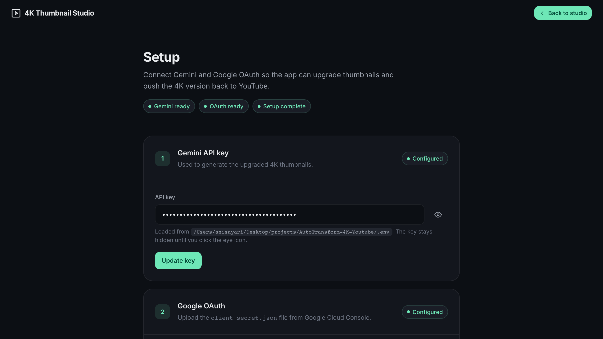
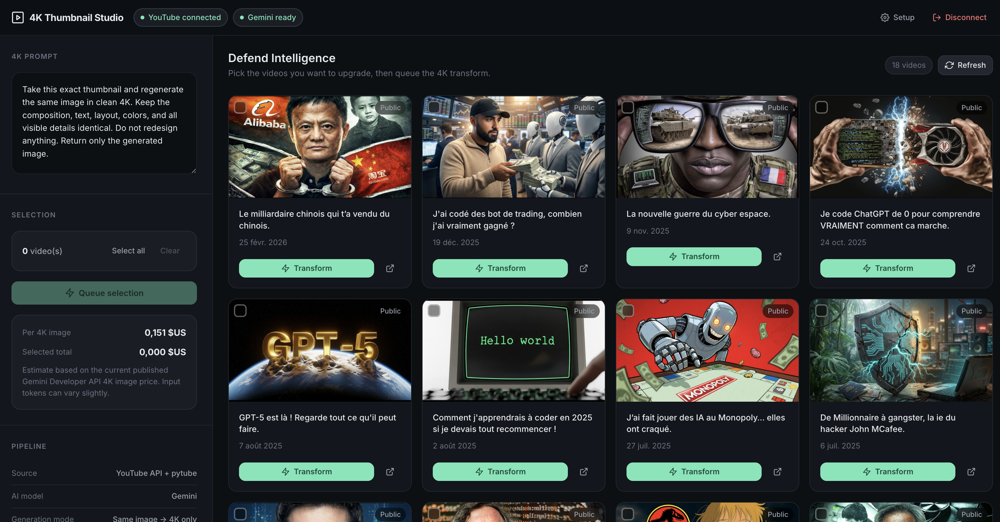

# AutoTransform 4K YouTube


> ⚠️ **WARNING / LIMITATION FOR NOW**
>
> YouTube announced on **October 29, 2025** that thumbnail uploads were moving from **2 MB** to **50 MB**.
>
> ✅ This repo is built around that **50 MB / 4K** direction.
>
> ⚠️ But as of **March 15, 2026**, the YouTube Data API endpoint `thumbnails.set` can still return a practical **2 MB** limit:
> `MediaUploadSizeError: 2097152`
>
> 🛠️ So for now, the product direction is **4K / 50 MB**, but the automated upload step is still waiting for YouTube to fully update the API side too.

YouTube raised thumbnail uploads from 2 MB to 50 MB. That changes the job of this app.

This project is a small Flask studio for pulling thumbnails from your YouTube videos, upgrading them with Gemini, and pushing 4K-ready versions back to YouTube in batches. You pick the videos. The app does the repetitive part.

The update above is based on YouTube's own announcement and Neal Mohan's post:

- 📢 [YouTube Blog: 5 new features to help creators shine on TV screens](https://blog.youtube/news-and-events/new-features-to-help-creators/)
- 📣 [Neal Mohan post mirror](https://twstalker.com/nealmohan/status/1983586662560231444)

## Interface

### Setup



### Studio



The main studio view once videos are loaded and ready for selection.

## What it does

- Loads the videos from your channel through the official YouTube Data API
- Pulls the current thumbnail through the official API, with `pytube` as fallback
- Sends the image to a configurable Gemini image model
- 💾 Saves a local 4K master in `instance/media/generated/`
- 🖼️ Prepares a 4K upload-ready JPEG
- 🚀 Uploads the upgraded thumbnail back to YouTube with `thumbnails.set`

This is built for batch work. If you want to refresh a backlog of thumbnails now that 4K uploads are practical, this is the workflow.

## Why Google OAuth matters 🔐

This app needs a real Google OAuth app because it does more than read public YouTube data.

- Reading your own channel, listing videos, and especially uploading a thumbnail are private, account-level actions.
- A simple API key is not enough for that. Google requires OAuth 2.0 with user consent for write operations like `thumbnails.set`.
- That is also the safer model: the app never asks for your Google password directly, access is limited to specific scopes, and you can revoke access anytime from your Google account permissions page.
- The `client_secret.json` file identifies your app to Google. Keep it private and never commit it to GitHub.

Official references:

- [YouTube Data API overview](https://developers.google.com/youtube/v3/getting-started)
- [Using OAuth 2.0 for web server apps](https://developers.google.com/youtube/v3/guides/auth/server-side-web-apps)
- [thumbnails.set reference](https://developers.google.com/youtube/v3/docs/thumbnails/set)

## Stack

- `Flask` for the backend and UI
- `google-api-python-client` for YouTube Data API v3
- `google-auth-oauthlib` for Google / YouTube OAuth
- `google-genai` for Gemini image generation
- `pytube` as a fallback thumbnail source
- `Pillow` for image normalization and 4K-ready output prep

## Requirements

- Python 3.11+ recommended
- A Google Cloud project
- `YouTube Data API v3` enabled
- A Google OAuth client of type `Web application`
- A Gemini API key
- A YouTube channel that can upload custom thumbnails

Helpful YouTube links:

- [Add video thumbnails on YouTube](https://support.google.com/youtubecreatorstudio/answer/7024632?hl=en)
- [Get access to intermediate and advanced features](https://support.google.com/youtube/answer/9891124?hl=en)

## Install

```bash
python -m pip install -r requirements.txt
cp .env.example .env
```

Use the Python interpreter from your own environment. If your machine uses `python3`, replace `python` with `python3` in the commands above and below.

In Google Cloud Console:

1. Enable `YouTube Data API v3`
2. Create an OAuth client of type `Web application`
3. Add `http://localhost:5001/auth/google/callback` to the allowed redirect URIs

## Google / YouTube setup step by step 🧭

### 1. Create or pick a Google Cloud project

Open the Google Cloud Console:

- [Google Cloud Console](https://console.cloud.google.com/)

### 2. Enable the YouTube Data API

Open the API library and enable YouTube Data API v3 for your project:

- [Enable YouTube Data API v3](https://console.cloud.google.com/apis/library/youtube.googleapis.com)

### 3. Configure the OAuth consent screen

If Google asks for branding or consent screen details, complete that first:

- [OAuth setup guide](https://developers.google.com/youtube/v3/guides/auth/server-side-web-apps)

In practice, for local personal use, you usually just need the basic app information so Google can issue credentials for your web app.

### 4. Create a Web application OAuth client

Go to the credentials page and create an OAuth client:

- [Google Cloud credentials page](https://console.cloud.google.com/apis/credentials)

Choose:

- `Create credentials`
- `OAuth client ID`
- Application type: `Web application`

### 5. Add the exact local URLs used by this app

Use these values:

- Authorized JavaScript origin: `http://localhost:5001`
- Authorized redirect URI: `http://localhost:5001/auth/google/callback`

These must match the app exactly. If you change the port later, you must update both:

- your `.env` / `GOOGLE_REDIRECT_URI`
- your Google Cloud OAuth client settings

### 6. Download `client_secret.json`

After creating the OAuth client:

- download the `client_secret.json` file
- keep it private
- do not commit it to GitHub
- upload it in the app Setup screen

Google only shows the client secret at creation time, so save the file somewhere safe.

### 7. Make sure your YouTube channel can upload custom thumbnails

This matters because the app ultimately calls the same thumbnail upload capability on your channel.

Check these official YouTube help pages:

- [Add video thumbnails on YouTube](https://support.google.com/youtubecreatorstudio/answer/7024632?hl=en)
- [Feature eligibility and verification](https://support.google.com/youtube/answer/9891124?hl=en)

### 8. Add your Gemini API key

You also need a Gemini API key for image generation:

- [Get a Gemini API key](https://aistudio.google.com/app/apikey)

Paste it into the app Setup screen.

### 9. Start the app and finish setup

Run:

```bash
python run.py
```

Then in the app:

1. Open `Setup`
2. Add your Gemini API key
3. Upload `client_secret.json`
4. Click `Connect`
5. Accept the Google consent flow

Once connected, the app can load your videos and attempt thumbnail updates on your behalf.

## Run

```bash
python run.py
```

On first launch, the app opens the Setup screen if anything is missing. From there you can:

- Save your Gemini API key
- Upload `client_secret.json`
- Connect your YouTube account

Minimum environment variables:

```env
FLASK_SECRET_KEY=your-secret-key
GEMINI_API_KEY=your-gemini-key
```

## Workflow

1. Click `Connect YouTube`
2. Authorize access to your channel
3. Load your recent videos
4. Select the thumbnails you want to upgrade
5. Adjust the prompt if needed
6. Run the transform
7. The app uploads the new 4K-ready thumbnail to YouTube

## Useful environment variables

- `GOOGLE_CLIENT_SECRETS_FILE`: path to the OAuth client file
- `GOOGLE_REDIRECT_URI`: OAuth callback URL
- `YOUTUBE_TOKEN_FILE`: local file used to store the user token
- `YOUTUBE_MAX_VIDEOS`: maximum number of videos to display
- `GEMINI_IMAGE_MODEL`: Gemini image model to use
- `GEMINI_IMAGE_ASPECT_RATIO`: keep this at `16:9`
- `GEMINI_IMAGE_SIZE`: use `4K` when the selected model supports it
- `DEFAULT_TRANSFORM_PROMPT`: default prompt loaded in the UI

## Project layout

```text
thumbnail_studio/
  services/
    auth.py
    gemini.py
    image_tools.py
    youtube.py
  static/
  templates/
tests/
run.py
```

## Tests

```bash
python -m pytest -q
```

Current coverage includes:

- Flask app rendering
- Automatic redirect to Setup when config is incomplete
- Gemini key persistence in `.env`
- `client_secret.json` upload handling
- Auth gating on API endpoints
- Batch processing for selected videos
- 4K thumbnail preparation for YouTube uploads

## Notes

- `pytube` is not stable over time. Here it is only a fallback.
- Your channel still needs access to custom thumbnails on YouTube.
- The app now targets 4K-ready uploads, but the actual result still depends on the Gemini model you choose and the quality of the source thumbnail.
- If your account cannot access the configured Gemini model, change `GEMINI_IMAGE_MODEL` in `.env`.

## References

- [YouTube Data API: thumbnails.set](https://developers.google.com/youtube/v3/docs/thumbnails/set)
- [Gemini API image generation](https://ai.google.dev/gemini-api/docs/image-generation)
