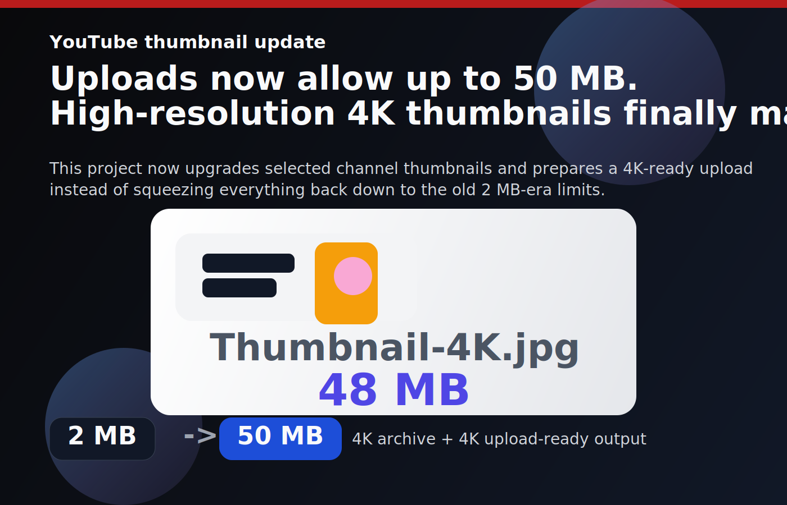

# AutoTransform 4K YouTube



YouTube raised thumbnail uploads from 2 MB to 50 MB. That changes the job of this app.

This project is a small Flask studio for pulling thumbnails from your YouTube videos, upgrading them with Gemini, and pushing 4K-ready versions back to YouTube in batches. You pick the videos. The app does the repetitive part.

The update above is based on YouTube's own announcement and Neal Mohan's post:

- [YouTube Blog: 5 new features to help creators shine on TV screens](https://blog.youtube/news-and-events/new-features-to-help-creators/)
- [Neal Mohan post mirror](https://twstalker.com/nealmohan/status/1983586662560231444)

## What it does

- Loads the videos from your channel through the official YouTube Data API
- Pulls the current thumbnail through the official API, with `pytube` as fallback
- Sends the image to a configurable Gemini image model
- Saves a local 4K master in `instance/media/generated/`
- Prepares a 4K upload-ready JPEG under YouTube's current file size limit
- Uploads the upgraded thumbnail back to YouTube with `thumbnails.set`

This is built for batch work. If you want to refresh a backlog of thumbnails now that 4K uploads are practical, this is the workflow.

## Stack

- `Flask` for the backend and UI
- `google-api-python-client` for YouTube Data API v3
- `google-auth-oauthlib` for Google / YouTube OAuth
- `google-genai` for Gemini image generation
- `pytube` as a fallback thumbnail source
- `Pillow` for image normalization and 4K-ready output prep

## Requirements

- Python 3.11+ recommended
- A Google Cloud project
- `YouTube Data API v3` enabled
- A Google OAuth client of type `Web application`
- A Gemini API key

## Install

```bash
python -m pip install -r requirements.txt
cp .env.example .env
```

Use the Python interpreter from your own environment. If your machine uses `python3`, replace `python` with `python3` in the commands above and below.

In Google Cloud Console:

1. Enable `YouTube Data API v3`
2. Create an OAuth client of type `Web application`
3. Add `http://localhost:5001/auth/google/callback` to the allowed redirect URIs

## Run

```bash
python run.py
```

On first launch, the app opens the Setup screen if anything is missing. From there you can:

- Save your Gemini API key
- Upload `client_secret.json`
- Connect your YouTube account

Minimum environment variables:

```env
FLASK_SECRET_KEY=your-secret-key
GEMINI_API_KEY=your-gemini-key
```

## Workflow

1. Click `Connect YouTube`
2. Authorize access to your channel
3. Load your recent videos
4. Select the thumbnails you want to upgrade
5. Adjust the prompt if needed
6. Run the transform
7. The app uploads the new 4K-ready thumbnail to YouTube

## Useful environment variables

- `GOOGLE_CLIENT_SECRETS_FILE`: path to the OAuth client file
- `GOOGLE_REDIRECT_URI`: OAuth callback URL
- `YOUTUBE_TOKEN_FILE`: local file used to store the user token
- `YOUTUBE_MAX_VIDEOS`: maximum number of videos to display
- `GEMINI_IMAGE_MODEL`: Gemini image model to use
- `GEMINI_IMAGE_ASPECT_RATIO`: keep this at `16:9`
- `GEMINI_IMAGE_SIZE`: use `4K` when the selected model supports it
- `DEFAULT_TRANSFORM_PROMPT`: default prompt loaded in the UI

## Project layout

```text
thumbnail_studio/
  services/
    auth.py
    gemini.py
    image_tools.py
    youtube.py
  static/
  templates/
tests/
run.py
```

## Tests

```bash
python -m pytest -q
```

Current coverage includes:

- Flask app rendering
- Automatic redirect to Setup when config is incomplete
- Gemini key persistence in `.env`
- `client_secret.json` upload handling
- Auth gating on API endpoints
- Batch processing for selected videos
- 4K thumbnail preparation for YouTube uploads

## Notes

- `pytube` is not stable over time. Here it is only a fallback.
- Your channel still needs access to custom thumbnails on YouTube.
- The app now targets 4K-ready uploads, but the actual result still depends on the Gemini model you choose and the quality of the source thumbnail.
- If your account cannot access the configured Gemini model, change `GEMINI_IMAGE_MODEL` in `.env`.

## References

- [YouTube Data API: thumbnails.set](https://developers.google.com/youtube/v3/docs/thumbnails/set)
- [Gemini API image generation](https://ai.google.dev/gemini-api/docs/image-generation)
